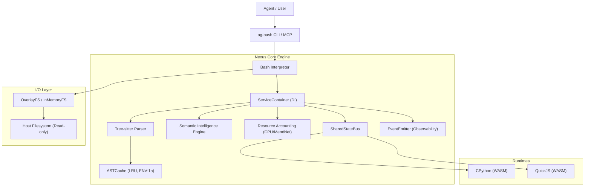

# 🏛️ Ag-Bash Architecture (v4.1.0)

This document provides a deep dive into the high-performance architectural components of **v3.0.0**, building on the foundations laid in **v2.0.0 "Nexus Prime"** and **v2.4.x "Project V-Next"**.

---

## 🏗️ High-Level Overview

Ag-Bash is designed as a **Secure Unified Agentic Runtime**. Unlike traditional shells, it optimizes for high-frequency agentic queries, cross-runtime visibility, and resource accounting.

---

## 🧠 Nexus AST Engine & ASTCache

To reduce the latency of script execution, Ag-Bash introduced the **ASTCache** in v1.5.0, with a major upgrade in v3.0.0.

### The Problem

Traditional shells re-parse scripts every time they are executed. For autonomous agents that run many small commands in sequence, parsing represents a significant percentage of total execution time.

### The Solution: ASTCache

The `ASTCache` is an LRU (Least Recently Used) cache that stores parsed Tree-sitter AST nodes. In v3.0.0, it was upgraded to a true LRU implementation owned per-instance via `ServiceContainer`.

- **Keying**: Input script strings are hashed using **FNV-1a** (non-cryptographic) for browser compatibility and ~10x faster key generation than the previous SHA-256 approach.
- **Short-circuit**: Inputs shorter than 64 characters bypass hashing entirely for maximum throughput.
- **LRU Eviction**: Uses JavaScript `Map` insertion-order semantics (delete + re-set) for O(1) promotion. A fixed memory footprint (default 100 entries) ensures the cache doesn't grow unbounded.
- **TTL**: Entries have a default TTL of 1 hour to prevent stale state in dynamic scripts.
- **Observability**: `stats()` exposes hit/miss counters; `configure()` allows runtime tuning of capacity and TTL.

---

## ⚡ SharedStateBus: Inter-Runtime Communication

Project Nexus enables **Shared State Persistence** across Bash, Python, and JavaScript.

### Architecture

The `SharedStateBus` is an event bus that allows different runtimes to synchronize variables and state changes. As of v3.0.0, `SharedStateBus` is **no longer a singleton** — each `Bash` instance owns its own bus via the `ServiceContainer` dependency injection system (see below).

- **Event-Driven**: Components publish events (e.g., `state:variable_set`) to the bus via type-safe `publishTyped<T>()` methods.
- **State Shadowing**: The bus maintains a "Shadow Map" of the current environment state accessible to any runtime, retrievable with `getStateAs<T>()`.
- **Error Handling**: A dedicated `BusErrorHandler` interface allows host applications to intercept and handle bus-level failures.
- **Cross-Language Bindings**:
  - **Bash**: Access via `ag-snapshot` and environment expansion.
  - **Python/JS**: Access via built-in bridge libraries that communicate with the bus via the `Interpreter`.

---

## 🏭 ServiceContainer: Dependency Injection (v3.0.0)

In v3.0.0, all previously-global singletons (`AgentManager`, `McpClient`, `SessionManager`, `Orchestrator`, `LSPManager`) were eliminated. Services are now owned **per-`Bash` instance** through the `ServiceContainer` pattern.

### Design

- **Factory**: `createDefaultServices()` constructs the full service graph. Each service receives its dependencies via constructor injection, enabling straightforward override for testing.
- **Access**: `bash.services` exposes `astCache`, `sharedBus`, `sessionManager`, `agentManager`, `mcpClient`, `orchestrator`, and `lspManager`.
- **Isolation**: Multiple `Bash` instances can coexist in the same process without shared mutable state. The only remaining process-wide singleton is `DefenseInDepthBox`, which patches `AsyncLocalStorage` globally by necessity.
- **Testability**: Integration tests can inject mock services at construction time without monkey-patching globals.

---

## 🛡️ Resource Governance & Accounting

Ag-Bash v2.0.0 introduces hardened **Resource Accounting** to prevent runaway compute, memory, or network exhaustion in agentic loops.

### Performance Accounting

The `Interpreter` now accounts for resources in real-time:

- **Memory Tracking**: Estimates total object graph size during evaluation. If memory exceeds `maxMemoryAccountingBytes` (default 50MB), execution is aborted with an `ExecutionLimitError`.
- **CPU Time**: Tracks total execution time in milliseconds. If a script exceeds `maxCpuMs` (default 30s), the process is forcefully terminated.
- **Network Traffic**: Monitors total bytes sent/received via `curl`. Exceeding `maxNetworkTrafficBytes` (default 100MB) triggers immediate cancellation.
- **Agentic Nesting**: Prevents recursive agent loops by enforcing a maximum sub-agent depth via `maxAgentNesting` (default 3).

---

## 📡 Tooling 2.0: High-Fidelity Observability

Ag-Bash v2.4.0 introduces a standard **EventEmitter** interface for the `Bash` class, enabling real-time integration with external orchestrators and IDEs.

### Tool Lifecycle Events

The `BashToolbox` now emits structured events during tool execution:

- `tool:start`: Emitted before tool validation. Includes `toolName` and `args`.
- `tool:progress`: Emitted during long-running tool execution (if supported by the tool).
- `tool:end`: Emitted after tool completion. Includes `duration`, `status`, and `resultSummary`.

These hooks allow host applications to drive UI progress bars, performance telemetry, and audit logs without polling the interpreter state.

---

## 🩹 Agentic Healer 2.0: Semantic Discovery

The `AgenticHealer` has been refactored to be **environment-aware**, leveraging the full power of the tool registry for recovery.

### Tool-Aware Remediation

When a shell command fails, the healer doesn't just suggest text fixes. It now performs a **Semantic Discovery** pass:

1. **Failure Analysis**: Captures `stderr` and exit codes.
2. **Registry Scoring**: Uses a multi-keyword semantic scoring engine to find tools in the registry that match the failure context (e.g., `no such file` -> `analyze_code` or `ag-find-symbol`).
3. **Structured Remediation**: Provides the agent with a prioritized list of executable tools to fix the environment state.

---

## 🔍 Semantic Intelligence Engine

Nexus Prime introduces a native semantic analysis layer built directly into the shell evaluation loop.

### Capabilities

- **Command Explanation**: The `ag-explain` tool utilizes the Tree-sitter AST to provide structural breakdowns of complex pipelines, identifying flags, redirections, and subshells.
- **Symbol Indexing**: Global symbol discovery via `ag-find-symbol` allows agents to map function definitions and variable usages across the entire virtual filesystem.
- **Contextual Metadata**: `ag-hover` provides real-time documentation and type-hints for built-in and user-defined symbols.

---

## 📁 Virtual Filesystem (OverlayFS)

Ag-Bash utilizes an **Overlay Filesystem (CoW)** to ensure host safety.

- **Lower Layer**: Your actual project files (Read-only).
- **Upper Layer**: An ephemeral, in-memory layer for all writes.
- **Resolution**: Filename lookups merge these layers, giving the agent a seamless view while protecting the underlying disk.

---

## ⚙️ BashOptions Configuration (v3.0.0)

In v3.0.0, the flat `BashOptions` configuration was restructured into grouped sub-objects for clarity and discoverability:

| Sub-object | Contains (previously flat) |
|------------|---------------------------|
| `runtimes` | `python`, `javascript` |
| `security` | `defenseInDepth`, `processInfo` |
| `parser` | `engine`, `treeSitterConfig` |
| `debug` | `logger`, `trace`, `coverage`, `debugger`, `semanticEngine` |
| `agentic` | `enabled`, `healer`, `nestingDepth`, `permissionHandler` (previously a boolean) |
| `executionLimits` | `maxMemoryAccountingBytes`, `maxCpuMs`, `maxNetworkTrafficBytes` (previously top-level `maxCallDepth`, `maxCommandCount`, `maxLoopIterations` — removed) |

This is a **breaking change** from v2.x. Consumers must migrate flat option fields to their respective sub-objects.

---

## 🧰 Nexus Suite: Surgical Editing Tools

The **Nexus Suite** provides a cohesive set of tools purpose-built for agentic file manipulation:

- **`ag-edit`**: High-performance line-based file editor with multi-chunk support and SHA-256 staleness protection (prevents overwriting concurrent changes).
- **`ag-diff`**: Semantic diffing tool that produces LLM-optimized summaries alongside traditional unified diffs.
- **`ag-snapshot`**: Persistent state capture (environment variables, functions, CWD, VFS) saved to `.ag-snapshots/` for session replay and recovery.

### Plan Mode

The `ag-plan` command activates **Planning Mode** — a read-only sandbox where destructive tools are automatically blocked. This allows agents to design multi-step strategies with checkpoints before committing any changes to the filesystem.

---

## 🚀 Future Roadmap

- **Async Streaming I/O**: Implementing non-blocking stream pipes between WASM runtimes.
- **Global JIT Parser**: Pre-parsing entire repositories into the `ASTCache` for instant global lookups.
