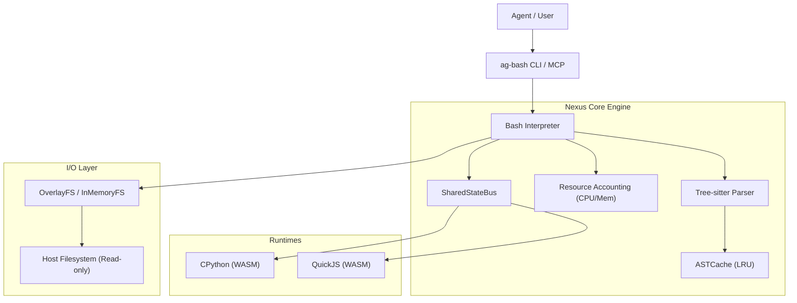

# 🏛️ Ag-Bash Architecture: Project Nexus (v1.5.0)

This document provides a deep dive into the high-performance architectural components introduced in the **v1.5.0 "Nexus"** release.

---

## 🏗️ High-Level Overview

Ag-Bash is designed as a **Secure Unified Agentic Runtime**. Unlike traditional shells, it optimizes for high-frequency agentic queries, cross-runtime visibility, and resource accounting.

---

## 🧠 Nexus AST Engine & ASTCache

To reduce the latency of script execution, Ag-Bash v1.5.0 introduces the **ASTCache**.

### The Problem

Traditional shells re-parse scripts every time they are executed. For autonomous agents that run many small commands in sequence, parsing represents a significant percentage of total execution time.

### The Solution: ASTCache

The `ASTCache` is a global LRU (Least Recently Used) cache that stores parsed Tree-sitter AST nodes.

- **Keying**: Input script strings are hashed using SHA-256 to create unique cache keys.
- **TTL**: Entries have a default TTL of 1 hour to prevent stale state in dynamic scripts.
- **Eviction**: A fixed memory footprint (default 100 entries) ensures the cache doesn't grow unbounded.

---

## ⚡ SharedStateBus: Inter-Runtime Communication

Project Nexus enables **Shared State Persistence** across Bash, Python, and JavaScript.

### Architecture

The `SharedStateBus` is a singleton event bus that allows different runtimes to synchronize variables and state changes.

- **Event-Driven**: Components publish events (e.g., `state:variable_set`) to the bus.
- **State Shadowing**: The bus maintains a "Shadow Map" of the current environment state accessible to any runtime.
- **Cross-Language Bindings**:
  - **Bash**: Access via `ag-snapshot` and environment expansion.
  - **Python/JS**: Access via built-in bridge libraries that communicate with the bus via the `Interpreter`.

---

## 🛡️ Resource Governance & Accounting

Ag-Bash v1.5.0 introduces strict **Resource Accounting** to prevent runaway compute or memory exhaustion in agentic loops.

### Performance Accounting

The `Interpreter` now accounts for resources in real-time:

- **Memory Tracking**: Estimates total object graph size during evaluation. If memory exceeds `maxMemoryAccountingBytes` (default 50MB), execution is aborted with an `ExecutionLimitError`.
- **CPU Time**: Tracks total execution time in milliseconds. If a script exceeds `maxCpuMs` (default 30s), the process is forcefully terminated.

---

## 📁 Virtual Filesystem (OverlayFS)

Ag-Bash utilizes an **Overlay Filesystem (CoW)** to ensure host safety.
- **Lower Layer**: Your actual project files (Read-only).
- **Upper Layer**: An ephemeral, in-memory layer for all writes.
- **Resolution**: Filename lookups merge these layers, giving the agent a seamless view while protecting the underlying disk.

---

## 🚀 Future Roadmap

- **Async Streaming I/O**: Implementing non-blocking stream pipes between WASM runtimes.
- **Global JIT Parser**: Pre-parsing entire repositories into the `ASTCache` for instant global lookups.
